<div align="center">

<!-- Shopify Pixel Art Header -->


# 👾 Hi, I'm Phuc - Shopify Developer


[](https://shopify.dev)
[](https://react.dev)
[](https://nodejs.org)
[](https://shopify.dev/docs/api/liquid)

</div>

---

## 🎮 About Me - Pixel World Edition

```javascript
const phuc = {
  role: "Shopify Developer 👨‍💻",
  location: "Vietnam 🇻🇳",
  currentProject: "Kefoff Coffee Shop ☕",
  
  skills: {
    shopifyTheme: ["Liquid", "Dawn Theme", "Custom Sections", "Metafields"],
    shopifyApp: ["React Router", "Polaris", "GraphQL", "Customer Account UI"],
    frontend: ["React", "Preact", "JavaScript", "HTML/CSS"],
    backend: ["Node.js", "Shopify API", "Prisma", "SQLite"],
    tools: ["Git", "Docker", "Shopify CLI", "VS Code"]
  },
  
  currentlyLearning: ["Shopify Functions", "Hydrogen", "Remix"],
  
  funFact: "I build coffee shop experiences in the digital world! ☕✨",
  
  motto: "Code with ❤️, Deploy with 🚀, Debug with ☕"
};
```

---

## 🏆 Featured Projects

### ☕ Kefoff Coffee Shop - Complete E-commerce Solution

<table>
<tr>
<td width="50%">

#### 🎨 **Shopify Theme Development**
- ✅ Custom Liquid sections & blocks
- ✅ Responsive mobile-first design
- ✅ Dynamic header with video hero
- ✅ Custom footer with social integration
- ✅ Landing page sections (LDP)
- ✅ Membership pass system

**Tech Stack:**
- Liquid
- JavaScript (ES6+)
- CSS3 with animations
- Shopify Metafields

</td>
<td width="50%">

#### 📱 **Shopify App Development**
- ✅ Customer Account UI Extension
- ✅ Real-time pass tracking
- ✅ Usage countdown timer (4h)
- ✅ Calendar history view
- ✅ Seasonal icon system
- ✅ Shopify Flow integration

**Tech Stack:**
- React Router
- Polaris Web Components
- GraphQL API
- Preact Hooks

</td>
</tr>
</table>

---

## 💻 Tech Stack - Pixel Edition

<div align="center">

### 🎯 Shopify Ecosystem


### 🚀 Frontend Development


### ⚙️ Backend & Tools


</div>

---

## 📊 GitHub Stats - Level Up! 🎮

<div align="center">
  


</div>

<div align="center">
  
[](https://git.io/streak-stats)

</div>

---

## 🎯 What I'm Working On


---

## 🏅 Shopify Skills & Achievements

<div align="center">

| 🎨 **Theme Development** | 📱 **App Development** | 🔧 **Tools & APIs** |
|:---:|:---:|:---:|
| ⭐⭐⭐⭐⭐ Liquid | ⭐⭐⭐⭐⭐ React Router | ⭐⭐⭐⭐⭐ Shopify CLI |
| ⭐⭐⭐⭐⭐ Custom Sections | ⭐⭐⭐⭐⭐ Polaris | ⭐⭐⭐⭐⭐ GraphQL |
| ⭐⭐⭐⭐⭐ Metafields | ⭐⭐⭐⭐ Customer Account UI | ⭐⭐⭐⭐ Shopify Flow |
| ⭐⭐⭐⭐ Performance | ⭐⭐⭐⭐ Preact Hooks | ⭐⭐⭐⭐ REST/Admin API |
| ⭐⭐⭐⭐ Responsive Design | ⭐⭐⭐ App Extensions | ⭐⭐⭐ Webhooks |

</div>

---

## 🎮 Code Contributions - Pixel Map

<div align="center">


</div>

---

## 💡 Recent Highlights

<table>
<tr>
<td width="33%" align="center">

### 🎨 Theme Features
```
✅ 15+ Custom Sections
✅ Mobile-First Design
✅ Video Hero Header
✅ Dynamic Animations
✅ SEO Optimized
```

</td>
<td width="33%" align="center">

### 📱 App Features
```
✅ Real-time Tracking
✅ Countdown Timer
✅ Calendar View
✅ Seasonal Icons
✅ Usage Analytics
```

</td>
<td width="33%" align="center">

### 🚀 Performance
```
✅ Fast Load Times
✅ CDN Optimized
✅ Lazy Loading
✅ WebP Images
✅ Code Splitting
```

</td>
</tr>
</table>

---

## 🎯 Shopify Development Workflow

```mermaid
graph LR
    A[💡 Idea] --> B[📝 Planning]
    B --> C[🎨 Design]
    C --> D[💻 Development]
    D --> E[🧪 Testing]
    E --> F[🚀 Deploy]
    F --> G[📊 Monitor]
    G --> H[🔄 Iterate]
    H --> D
    
    style A fill:#95BF47,stroke:#7AB55C,color:#000
    style F fill:#95BF47,stroke:#7AB55C,color:#000
    style D fill:#5C6AC4,stroke:#4C5AB4,color:#fff
```



---

## 📚 Knowledge Base

<details>
<summary>🎨 <b>Shopify Theme Development</b></summary>

### Expertise Areas:
- ✅ **Liquid Templating:** Advanced filters, loops, conditionals
- ✅ **Section Schema:** Dynamic settings, blocks, presets
- ✅ **Metafields:** Custom data structures, JSON metafields
- ✅ **Theme Architecture:** Modular, scalable code organization
- ✅ **Performance:** Lazy loading, critical CSS, image optimization
- ✅ **Responsive Design:** Mobile-first, breakpoints, flexbox/grid
- ✅ **Animations:** CSS transitions, keyframes, scroll effects

### Recent Projects:
- Custom LDP (Landing Page) sections with animations
- Dynamic header with `mix-blend-mode` for video backgrounds
- Membership pass system with metafield integration
- Custom footer with social media integration

</details>

<details>
<summary>📱 <b>Shopify App Development</b></summary>

### Expertise Areas:
- ✅ **React Router:** App structure, routing, loaders
- ✅ **Polaris Web Components:** UI consistency, accessibility
- ✅ **GraphQL API:** Customer Account API, Admin API
- ✅ **Customer Account UI:** Extensions, metafield management
- ✅ **State Management:** Preact hooks, useEffect, useState
- ✅ **Real-time Features:** Countdown timers, live updates
- ✅ **Data Visualization:** Calendar views, progress bars

### Recent Projects:
- Customer Account UI Extension for pass management
- Real-time countdown timer (4-hour cycle)
- Calendar history view with seasonal icons
- Usage tracking with Shopify Flow integration

</details>

<details>
<summary>🔧 <b>Tools & Integrations</b></summary>

### Expertise Areas:
- ✅ **Shopify CLI:** Theme/app development, deployment
- ✅ **Git/GitHub:** Version control, collaboration
- ✅ **Docker:** Containerization, development environments
- ✅ **Shopify Flow:** Automation, webhooks, metafield updates
- ✅ **Lighthouse CI:** Performance monitoring, optimization
- ✅ **Prisma:** Database ORM, migrations
- ✅ **VS Code:** Extensions, snippets, debugging

</details>

---

## 🌟 Featured Code Snippets

<details>
<summary>💻 <b>Liquid: Dynamic Section with Metafields</b></summary>

```liquid

  Custom Pass Display Section
  Uses customer metafields for dynamic content





  <div class="pass-container">
    
    <h2>{{ pass_data.passName }}</h2>
    <p>Code: <strong>{{ pass_data.passCode }}</strong></p>
    <p>Valid until: {{ pass_data.expiryDate | date: "%d/%m/%Y" }}</p>
  </div>



{
  "name": "Pass Display",
  "settings": [
    {
      "type": "text",
      "id": "metafield_namespace",
      "label": "Metafield Namespace",
      "default": "custom"
    }
  ]
}

```

</details>

<details>
<summary>⚛️ <b>React: Real-time Countdown Timer</b></summary>

```javascript
// Real-time countdown hook for Ultimate Pass
useEffect(() => {
  if (!countdownStartTime) return;
  
  const FOUR_HOURS_MS = 4 * 60 * 60 * 1000;
  
  const updateCountdown = () => {
    const now = Date.now();
    const elapsed = now - countdownStartTime;
    const remaining = Math.max(0, FOUR_HOURS_MS - elapsed);
    
    setTimeRemaining(Math.floor(remaining / 1000));
    setCountdownProgress((elapsed / FOUR_HOURS_MS) * 100);
    
    return remaining > 0;
  };
  
  updateCountdown();
  const interval = setInterval(() => {
    if (!updateCountdown()) clearInterval(interval);
  }, 1000);
  
  return () => clearInterval(interval);
}, [countdownStartTime]);
```

</details>

<details>
<summary>🎨 <b>CSS: Shopify-style Animations</b></summary>

```css
/* Pixel-perfect hover effect */
.shopify-button {
  background: linear-gradient(135deg, #95BF47 0%, #7AB55C 100%);
  border-radius: 8px;
  padding: 12px 24px;
  transition: all 0.3s cubic-bezier(0.4, 0, 0.2, 1);
  box-shadow: 0 2px 8px rgba(149, 191, 71, 0.3);
}

.shopify-button:hover {
  transform: translateY(-2px);
  box-shadow: 0 4px 16px rgba(149, 191, 71, 0.5);
}

/* Pixel art animation */
@keyframes pixel-float {
  0%, 100% { transform: translateY(0px); }
  50% { transform: translateY(-10px); }
}

.pixel-character {
  animation: pixel-float 3s ease-in-out infinite;
}
```

</details>

---

## 🎨 Design Philosophy

<div align="center">

```
┌─────────────────────────────────────────────────────────────┐
│                                                             │
│  "Build experiences that customers love,                    │
│   with code that developers admire."                        │
│                                                             │
│   🎯 User-Centric  |  💻 Clean Code  |  🚀 Performance     │
│                                                             │
└─────────────────────────────────────────────────────────────┘
```

### My Development Principles:

🎨 **Beautiful UI** - Pixel-perfect designs with smooth animations  
⚡ **Performance First** - Fast load times, optimized assets  
📱 **Mobile-Friendly** - Responsive design for all devices  
♿ **Accessible** - WCAG compliant, semantic HTML  
🔒 **Secure** - Best practices, data protection  
📊 **Data-Driven** - Analytics, A/B testing, optimization  

</div>

---

## 🤝 Let's Connect - Join My Pixel World!

<div align="center">

[](https://your-portfolio.com)
[](https://linkedin.com/in/your-profile)
[](mailto:your.email@example.com)
[](https://github.com/trongphuc0401)

### 💬 Open for:
- 🛍️ Shopify Theme Customization
- 📱 Shopify App Development
- 🤝 Collaboration on E-commerce Projects
- ☕ Coffee Chat about Shopify Development

</div>

---

## 📈 Visitor Count

<div align="center">


### 🎮 Achievement Unlocked!
**You've reached the end of my profile!**


```
┌─────────────────────────────────────────┐
│  Thanks for visiting! 👾                │
│                                         │
│  ⭐ Star my repos if you like my work  │
│  🔔 Follow for Shopify tips & tricks   │
│  ☕ Let's build something amazing!     │
└─────────────────────────────────────────┘
```

**Made with ❤️ and lots of ☕ by Phuc**

*Last updated: December 2025*

</div>
